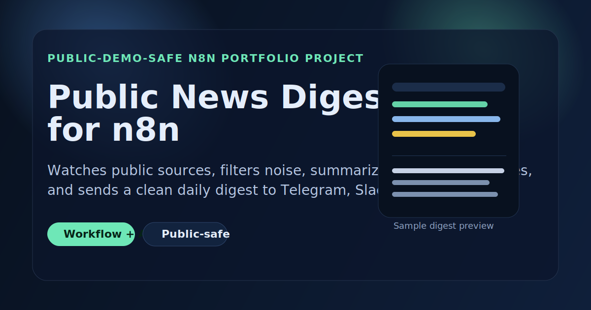

# Public News Digest for n8n

A portfolio project showcasing a public-safe n8n workflow that turns noisy public information sources into a clean, decision-friendly daily digest.

## Overview

This project was designed as a **public-facing portfolio case study**.

The goal was to demonstrate how I approach workflow automation when the audience needs to see:
- clear business value
- clean orchestration logic
- AI used practically, not just decoratively
- a workflow that is safe to show publicly

Instead of using private client data, internal systems, or confidential business processes, this project uses a **public-safe scenario**: monitoring public sources, filtering important updates, summarizing them, and delivering a clean digest.

## The problem

Operators, founders, marketers, and researchers often deal with too much scattered information:
- industry news
- product updates
- release announcements
- documentation changes
- public market signals

The problem is not a lack of information.
The problem is **too much low-signal information spread across too many places**.

## The solution

I designed an n8n workflow that:
- checks public feeds on a schedule
- collects recent updates
- filters weak or empty items
- scores likely relevance
- summarizes the strongest items with AI
- formats the results into a readable digest
- sends the final output to a delivery channel like Telegram, Slack, or email

The result is a workflow pattern that is useful, explainable, and easy to adapt to multiple industries.

## Why this project works as a portfolio piece

This project intentionally highlights the parts of automation work that matter to clients and recruiters:

- **Business framing**
  - The workflow solves a real attention and information problem.
- **Systems thinking**
  - It combines scheduling, parsing, filtering, scoring, summarization, and delivery.
- **Safe public presentation**
  - The use case can be demonstrated without exposing private records or credentials.
- **Reusable pattern design**
  - The same automation structure can be reused for many niches.

## My role

I created this project end-to-end as a portfolio-ready automation concept, including:
- workflow concept and use-case selection
- public-safe demo framing
- n8n workflow structure
- documentation and positioning
- public-facing HTML case-study page
- reusable repo structure for GitHub presentation

## Workflow logic

The workflow follows this sequence:

1. Scheduled trigger runs every morning
2. Public feeds or endpoints are queried
3. Source items are normalized into a consistent format
4. Empty or weak items are filtered out
5. Remaining items are scored for likely relevance
6. AI generates short summaries for selected items
7. A single digest is formatted for delivery
8. The digest is sent to Telegram, Slack, or email

## Business value

This workflow pattern can help teams:
- reduce time spent checking multiple sources manually
- improve signal-to-noise ratio in research workflows
- create consistent daily or weekly briefings
- repurpose the same structure for different monitoring needs

## Example industries / variants

This same automation structure can be adapted for:
- AI tools and model release tracking
- real estate market updates
- marketing and SEO changes
- open-source release digests
- public documentation change monitoring
- niche industry intelligence briefings

## Public-facing assets

This repo includes three main presentation assets:

- `app/index.html`
  - a public-facing case-study style project page
- `workflow/public-news-digest-workflow.json`
  - the reusable n8n workflow template
- `functions/api/demo-digest.js`
  - a safe live-demo endpoint for public visitors

## What this project demonstrates technically

- scheduled automation in n8n
- external feed fetching
- structured data normalization
- filtering and scoring logic
- AI summarization inside a workflow
- digest formatting for human consumption
- delivery to communication channels

## What I would improve next

If this were taken from portfolio concept to production-grade internal tooling, the next steps would be:
- stronger deduplication logic
- configurable scoring by topic
- multiple output formats
- persistent storage for historical digests
- approval / review step before delivery
- richer observability around digest quality

## Repo contents

- `app/index.html` — portfolio-facing project page
- `functions/api/demo-digest.js` — live demo endpoint for public-safe sample responses
- `server/index.js` — Dokploy runtime and optional protected bridge logic
- `.env.example` — optional bridge environment variables
- `workflow/public-news-digest-workflow.json` — n8n workflow template
- `sample-data/feed-items.json` — sample data for demonstration
- `docs/demo-script.md` — short walkthrough script
- `docs/deployment.md` — launch/deployment guide
- `assets/social-preview.svg` — repo preview graphic

## Notes

This repository is meant to be viewed as a **portfolio project first** and a reusable demo workflow second.

The workflow can be imported and extended, but the primary purpose of this repo is to demonstrate how I design and present useful automation systems in a public-safe way.

## License

MIT
